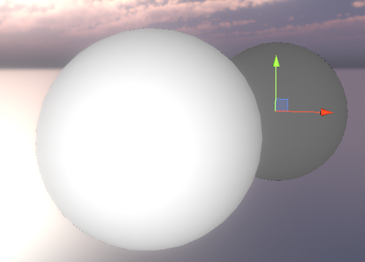

# Unity Shader Startup

Learn shader with Unity ShaderLab

 

---

## Animations

### Alpha Animation

### Blink Animation

### Dissolve Animation

### Water UV Animation

---

## Custom Lightings

### Cubemap Lighting

### Rim Lighting

### Hologram Animation

### Specular Lighting

### Toon Lighting

---

## Alpha Textures

### Alpha Blend

### Alpha Cutoff

---

## Theoretical

### Texture Lerp

### Lambert and BlinnPhong

### Texture UV Animation

### Vertex Color Masking

### Z-Depth Buffer

